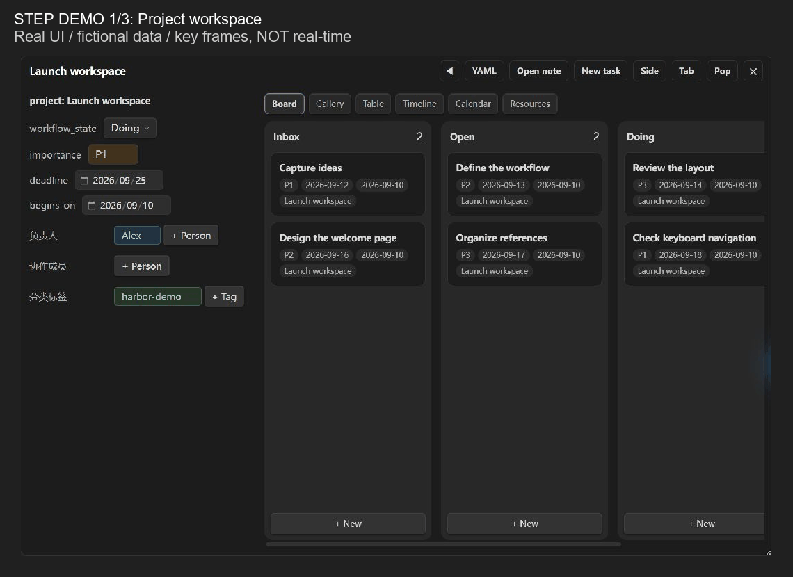
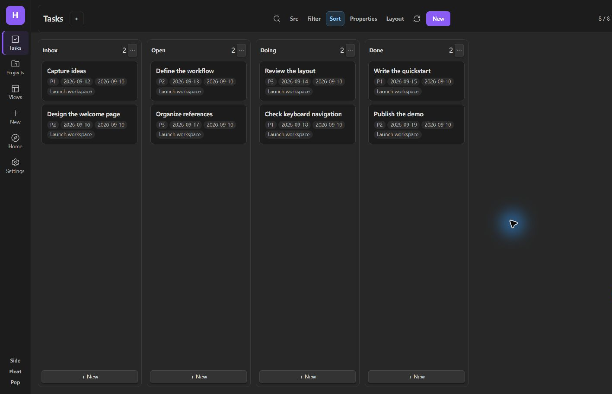

**中文** | [English](README.en.md)

# Harbor

**让笔记成为行动，让项目有处停靠。**

Harbor 是一款面向 [Obsidian](https://obsidian.md) 的本地优先工作台，将任务、项目和参考资料组织在一起。同一批 Markdown 笔记，可以在看板、画廊、日历、表格和时间线中查看；状态、日期等属性的修改会写回笔记的 YAML。

从收集一个想法，到推进一个项目，你可以在熟悉的笔记库里完成，不必另建一套任务数据。

[下载最新版](https://github.com/nbclass986/harbor/releases/latest) · [安装指南](#安装) · [反馈问题](https://github.com/nbclass986/harbor/issues) · [更新记录](CHANGELOG.md)

> 目前为免费公开试用版。需要 Obsidian **1.9.10+**；已进行本地桌面验证，手机实机及 BRAT 安装／自动更新仍待单独验收。


## 你可以用 Harbor 做什么

- **把想法变成下一步行动**：用 Inbox 收集，用 Open、Doing、Done 推进任务。
- **围绕项目组织工作**：将任务和资料关联到项目，在项目详情中集中查看。
- **按需要切换视角**：用看板看进度、日历看日期、表格看属性，或用画廊浏览卡片。
- **沿用自己的属性名称**：将已有 YAML 键映射到 Harbor 字段，不必为了插件统一改名。
- **建立自己的工作台**：筛选、排序、选择显示属性并保存常用视图；在标签页、侧栏或浮窗中打开。

支持简体中文、English 和自动语言选择，无需 Buttons 或 QuickAdd。

## 看看实际界面

以下画面来自真实 Obsidian 中的 Harbor 组件，使用虚构演示数据。**GIF 为关键帧步骤演示，非实时录屏，不用于证明操作速度或 YAML 写入成功。** [素材说明](media/README.md)

### 同一批笔记，不同的工作视角

在看板、画廊、表格和日历之间切换，让当前最重要的信息出现在眼前。


### 从 Inbox 到 Open

收集之后，再决定下一步。下图展示一条想法整理前后的两种状态，不是鼠标拖放录屏。


### 项目、属性与新建入口

查看项目关联任务，编辑自己的 YAML 属性，再添加下一条行动。



<details>
<summary>查看深色主题与更多截图</summary>



[画廊](media/gallery.png) · [日历](media/calendar.png) · [表格](media/table.png) · [项目详情](media/project.png) · [新建弹窗](media/create.png) · [属性面板](media/properties.png)

</details>

## 安装

首次体验建议使用测试库。项目笔记中的嵌入式关联任务表需要启用 Obsidian 核心插件 **Bases（数据库）**。

### 通过 BRAT 安装

1. 安装并启用 [BRAT](https://github.com/TfTHacker/obsidian42-brat)。
2. 运行命令 **BRAT: Add a beta plugin for testing**。
3. 输入仓库地址：`nbclass986/harbor`。
4. 安装完成后，在第三方插件中启用 **Harbor**。

后续可使用 **BRAT: Check for updates to all beta plugins** 检查更新。实际 BRAT 安装与自动更新尚未完成本轮实机验收。

### 手动安装

从 [Release](https://github.com/nbclass986/harbor/releases/latest) 下载 `main.js`、`manifest.json`、`styles.css`，放入笔记库的 `.obsidian/plugins/harbor/` 文件夹，再重新加载 Obsidian 并启用插件。

请下载上述三个安装附件，而不是 GitHub 自动生成的 “Source code” 压缩包。

## 从第一个项目开始

1. 点击左侧 Harbor 图标，或运行 **打开 Harbor** 命令。
2. 新建一个项目，例如「发布个人网站」。
3. 添加任务，例如「整理首页文案」，并关联到这个项目。
4. 设置状态、优先级和日期，在看板或日历中安排工作。
5. 配置筛选与排序，保存一个以后可以反复使用的视图。

Harbor 将笔记分为三类：**Project（项目）**记录想完成的结果，**Task（任务）**记录下一步行动，**Resource（资料）**保存参考内容。这种组织方式借鉴 PRT、GTD 和 PARA，但不要求你先学习这些方法才能使用。

主页提供近期、个人、闪念、超时未完成四个分区。每区可独立设置搜索、筛选、排序、显示属性和布局；这些设置作用于该分区原有的任务范围，不改变其他视图。

## 保留你自己的 YAML 名称

字段映射把 **Harbor 内部字段**连接到**笔记中实际使用的 YAML 键**。

| Harbor 内部字段 | 你的 YAML 键示例 | 属性面板显示 |
| --- | --- | --- |
| `status` | `workflow_state` | `workflow_state` |
| `due` | `deadline` | `deadline` |
| `assignee` | `负责人` | `负责人` |

例如，笔记使用 `deadline`，就在 `due` 对应的设置中填写 `deadline`。Harbor 按映射读写这个键，属性面板也显示 `deadline`，而不是另设展示名称。

**设置映射不等于批量重命名已有笔记。** 请先核对实际 YAML 键名，再配置对应关系。

<details>
<summary>查看一条使用默认字段的任务笔记</summary>

下面使用默认键名；如果修改了字段映射，笔记应使用对应的实际键名。

```markdown
---
type: task
status: Open
priority: P2
due: 2026-09-25
start: 2026-09-18
project:
  - "[[发布个人网站]]"
assignee: 张三
tags: writing
---
## Goal

整理首页文案。
```

文件名作为笔记标题。默认状态为 `Inbox`、`Open`、`Doing`、`Done`，优先级为 `P1`、`P2`、`P3`。

</details>

## 适应你的笔记库

| 目录模式 | 组织方式 |
| --- | --- |
| 混合式（默认） | 新建笔记进入 Harbor 分类目录，也识别库中符合类型配置的笔记 |
| 集中式 | 只读取配置的任务、项目和资料目录 |
| 散落式 | 新建项目时选择位置，创建项目文件夹及 `task`／`resource` 子目录 |

默认目录为 `Harbor/Harbor_TASK`、`Harbor/Harbor_PROJECT`、`Harbor/Harbor_RESOURCE` 和 `Harbor/Harbor_BASE`，可在设置中调整。

你还可以配置状态、优先级、人员、标签、属性面板字段和三类笔记模板。模板支持 `{{title}}`、`{{body}}`；未提供 `{{body}}` 时，新建表单正文会插入指定标题下。

界面配色跟随 Obsidian 主题，布局样式限定在 Harbor 内部。已检查默认浅色、默认深色及 Blue Topaz；不能保证所有第三方主题或自定义 CSS 都没有冲突。

## 当前状态与已知限制

- **桌面**：在 Windows / Obsidian 1.13.7 下检查了核心功能、字段映射、主题与窄容器；原生单卡、多卡拖放及日历改期由用户实机确认。
- **移动端**：尚未完成手机实机验收，窄栏测试不等于手机测试。
- **BRAT**：Release 已提供安装附件；客户端安装及自动更新仍待单独验证。
- **Notion**：同步为实验功能，默认关闭。启用并执行后，会与 Notion API 交换所选笔记内容；本轮未做联网同步验收。

## 反馈与许可

欢迎在 [Issues](https://github.com/nbclass986/harbor/issues) 提交问题或建议。请附上插件与 Obsidian 版本、操作系统、复现步骤，以及去除私人信息的截图或示例笔记。**请勿上传 Notion token 或插件的 `data.json`。**

当前版本按 [免费试用许可](LICENSE) 提供，可免费用于个人及工作内部使用；不授予再分发、销售或发布修改版的许可。此前按 MIT 发布的版本保留其原授权。
