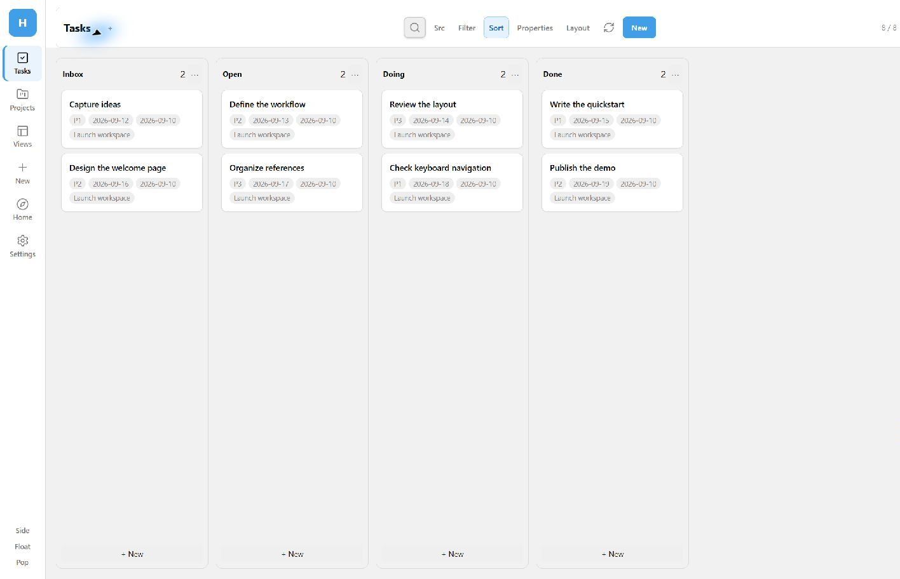
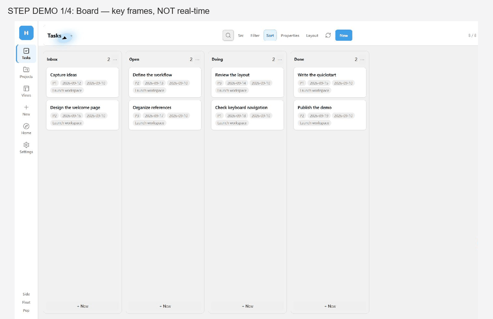
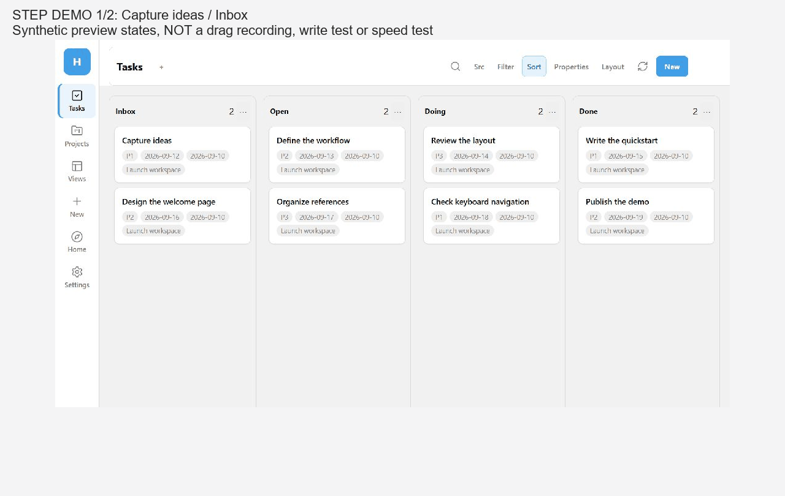

**中文** | [English](README.en.md)

# Harbor

Harbor 是一个 [Obsidian](https://obsidian.md) 插件：同一批 Markdown 笔记，用看板、画廊、日历、表格来看。拖卡片、改日期、改状态，写回笔记的 YAML。

分类用 **PRT**，推进用 **GTD** 和 **PARA**。界面语言：自动 / English / 简体中文。Notion 同步还在开发。

不依赖 Buttons、QuickAdd。

目前通过 GitHub + BRAT 免费公开试用，开发源码暂不公开。欢迎在 [Issues](https://github.com/nbclass986/harbor/issues) 反馈问题。

> 当前仓库文件为 **0.1.2 桌面候选版**，尚未创建对应 Release。BRAT 安装和自动更新仍以 Releases 为准；本地候选包加载成功不代表 BRAT 已验收。

## 工作台预览







状态变更 GIF 使用插件写入后截取的真实界面关键帧，并已还原演示笔记原状态；不是原生鼠标拖放录屏。

以上均为虚构演示笔记。GIF 是关键帧步骤演示，不用于证明速度。更多画面：[画廊](media/gallery.png) · [日历](media/calendar.png) · [表格](media/table.png) · [深色看板](media/board-dark.png) · [项目详情](media/project.png) · [新建弹窗](media/create.png) · [属性条](media/properties.png)。

### 0.1.2 候选版状态

- 统一工作台导航、工具栏和主题配色；看板、画廊、表格及时间线采用分批渲染，搜索与筛选仍覆盖全部数据，可滚动或点击“加载更多”。
- 修复元数据晚到时的缓存刷新、日历取消拖动误写日期，以及项目浮窗遮挡新建弹窗的问题。
- Windows / Obsidian 1.13.7 本地诊断：1,000 条任务的热搜索、筛选和视图切换 P95 为 **33.5–55.4 ms**；5,000 条为 **33.6–75.5 ms**（每项 20 次）。这是内存合成元数据上的真实渲染路径，包含两帧等待，不包含输入防抖、磁盘初始索引或应用冷启动，也不代表所有设备的性能。
- 三种目录模式创建／写入、保存视图重载、30 次窗口开关检查通过。默认浅／深色与 Blue Topaz × 400／720／1200 px × 六页面，54 组焦点、控件遮挡与滚动检查通过；修复了窄栏新建正文被底部按钮遮挡的问题。此矩阵针对工作台，不代表每个弹窗的所有组合。
- 后续真实 Markdown 磁盘测试：1,000 条热操作 P95 最高 **49.7 ms**，5,000 条最高 **76.0 ms**；元数据已就绪，不包含应用冷启动。三主题×三种容器宽度×六页面的 54 组工具栏／表单横向边界检查通过，不代替完整交互验收。
- 原生单卡、多卡拖放及日历鼠标改期均由用户实机确认成功。进程重启后，1,000 条磁盘任务首次可用 **1,891.4 ms**（从渲染导航起点计时，单次样本，Windows 文件缓存未清空，不包含启动器耗时）。实际 BRAT 安装／更新须在 Release 后验证；手机实机与 Notion 联网同步不在本轮范围内。

---

## 核心思想

同一批笔记，多种视图：

| 视图 | 做什么 |
| --- | --- |
| 看板 | 按状态、优先级或负责人分列，拖卡片改 YAML |
| 画廊 | 一张张卡片浏览 |
| 日历 | 月 / 周 / 日 / 议程 / 年 |
| 表格 | 工作台表格；项目笔记也可嵌入 Bases 列出关联任务 |
| 时间线 | 按截止日期的月份分组浏览 |
| 已保存视图 | 记住筛选和排序 |

三种类型：

| 类型 | YAML | 是什么 |
| --- | --- | --- |
| Project 项目 | `type: project` | 要完成的结果，下面挂任务 |
| Resource 资料 | `type: resource` | 参考材料 |
| Task 任务 | `type: task` | 下一步动作，可以属于某个项目 |

流转：收进 `Inbox` → 澄清成 Task / Project / Resource → 看板上 `Inbox` → `Open` → `Doing` → `Done`。截止日期和日历用来挑今天做哪条。

YAML 键名可以在设置里改，例如把 `due` 写成 `截止日期`。

---

## 安装

用 [BRAT](https://github.com/TfTHacker/obsidian42-brat)：

1. 安装 **BRAT**。
2. 命令面板运行 **BRAT: Add a beta plugin for testing**。
3. 填 [`nbclass986/harbor`](https://github.com/nbclass986/harbor)。
4. 启用 **Harbor**。

更新用 **BRAT: Check for updates to all beta plugins**。

或者从 [Releases](https://github.com/nbclass986/harbor/releases) 下载 `main.js`、`manifest.json`、`styles.css`，放到 `你的库/.obsidian/plugins/harbor/`。0.1.2 起需要 Obsidian 1.9.10 或更高；项目笔记中的关联任务表需要启用核心插件 **Bases（数据库）**。

首次试用建议在测试库中进行。移动端尚待完整验收；Notion 同步为实验功能，默认关闭。启用并执行同步后，会与 Notion API 交换你选择同步的笔记内容。

---

## 第一次打开

启用后会建这些文件夹：

| 文件夹 | 用途 |
| --- | --- |
| `Harbor/Harbor_TASK` | 新建任务 |
| `Harbor/Harbor_PROJECT` | 新建项目 |
| `Harbor/Harbor_RESOURCE` | 新建资料 |
| `Harbor/Harbor_BASE` | Bases 表 |

点左侧网格图标，或运行 **打开 Harbor**。

默认是**混合式**：新建进上面三个文件夹，带 `type` 的笔记也会上看板。还可以改成**集中式**（只看这三个文件夹）或**散落式**（新建项目时选位置，建项目文件夹，里面放项目笔记，并建 `task` / `resource` 子文件夹放关联笔记）。

---

## 一条任务

```yaml
---
type: task
status: Open
priority: P2
due: 2026-08-26
start: 2026-08-20
project:
  - "[[论文初稿]]"
assignee: 张三
participant: 李四
tags: writing
---
## Goal

写引言
```

状态：`Inbox`、`Open`、`Doing`、`Done`。优先级：`P1`、`P2`、`P3`。

文件名就是笔记标题，正文不再重复写一级标题。新建项目时，正文会嵌入 `Harbor_TASK.base` 里的项目任务表，并在 Tasks 下提供 **新建任务**、**新建资料**（会带上当前项目的负责人、参与人；任务默认 Open、P2）。

---

## 能做什么

- 看板、画廊、日历之间切换；项目里用 Bases 表格看关联任务
- 拖卡片改 YAML
- 按状态、优先级、负责人、标签、项目、日期筛选和排序，并保存视图
- 打开任务 / 项目 / 资料笔记时显示属性条；标题为 `task：文件名` 这类，可改 `type`
- 点项目卡片看下面的任务；项目笔记里可直接新建任务或资料
- 侧栏迷你日历
- 标签页、侧栏、浮动窗
- 新建模板可用 `{{title}}`、`{{body}}`；没有 `{{body}}` 时，正文插到设置里指定的标题下

---

## 命令

| 命令 | 作用 |
| --- | --- |
| 打开 Harbor | 标签页打开主界面 |
| 打开浮动窗口 / 在侧栏打开 / 在标签页打开 | 换窗口 |
| 打开迷你日历 | 侧栏日历 |
| 新建任务 / 新建项目 / 新建资料 | 弹出新建卡片 |
| 快速新建任务 | 建一条任务 |
| 打开属性 | 打开属性条 |

---

## 设置

语言、YAML 键名、属性条字段、文件夹、归档方式、是否扫描全库、状态 / 优先级 / 人员 / 标签、三类正文模板，以及每类模板的「正文插到此标题下」。

---

## 反馈与授权

反馈请附上 Harbor 和 Obsidian 版本、设备系统、复现步骤，以及不含私人内容的截图或示例笔记。请勿上传 Notion token 或插件的 `data.json`。

0.1.2 起按 [免费试用许可](LICENSE) 提供，可免费用于个人及工作内部使用；不授予再分发、销售或发布修改版的许可。开发源码暂不公开，之后是否公开及时间另行公告。已经按 MIT 发布的 0.1.0 / 0.1.1 保留原授权。
