**中文** | [English](README.en.md)

# Harbor

**让笔记成为行动，让项目有处停靠。**

Harbor 是一款面向 [Obsidian](https://obsidian.md) 的本地优先工作台，将任务、项目和参考资料组织在一起。同一批 Markdown 笔记，可以在看板、画廊、日历、表格和时间线中查看；状态、日期等属性的修改会写回笔记的 YAML。

从收集一个想法，到推进一个项目，你可以在熟悉的笔记库里完成，不必另建一套任务数据。

[下载最新版](https://github.com/nbclass986/harbor/releases/latest) · [安装指南](#安装) · [开箱教程](#开箱使用教程) · [反馈问题](https://github.com/nbclass986/harbor/issues) · [更新记录](CHANGELOG.md)

> 目前为免费公开试用版。需要 Obsidian **1.9.10+**；已进行本地桌面验证，手机实机及 BRAT 安装／自动更新仍待单独验收。


## 你可以用 Harbor 做什么

- **把想法变成下一步行动**：用 Inbox 收集，用 Open、Doing、Done 推进任务。
- **围绕项目组织工作**：将任务和资料关联到项目，在项目详情中集中查看。
- **让项目暂时停靠**：将项目浮窗折叠为标题条，继续操作其他笔记，需要时再展开接着处理。
- **按需要切换视角**：用看板看进度、日历看日期、表格看属性，或用画廊浏览卡片。
- **沿用自己的属性名称**：将已有 YAML 键映射到 Harbor 字段，不必为了插件统一改名。
- **建立自己的工作台**：筛选、排序、选择显示属性并保存常用视图；在标签页、侧栏或浮窗中打开。

支持简体中文、English 和自动语言选择，无需 Buttons 或 QuickAdd。

## 看看实际界面

以下画面来自真实 Obsidian 中的 Harbor 组件，使用虚构演示数据。**GIF 为关键帧步骤演示，非实时录屏，不用于证明操作速度或 YAML 写入成功。** [素材说明](media/README.md)

### 同一批笔记，不同的工作视角

在看板、画廊、表格和日历之间切换，让当前最重要的信息出现在眼前。


### 从 Inbox 到 Open

收集之后，再决定下一步。下图展示一条想法整理前后的两种状态，不是鼠标拖放录屏。


### 项目折叠停靠，不打断手头的工作

查资料、写笔记时，不必关掉正在处理的项目。将项目详情浮窗折叠为标题条，留在一旁；其他页面仍可继续点击、编辑和切换。需要回到项目时，再展开即可。

不是必须处理完才能关闭的弹窗，而是随时可以收起、随时接着工作的项目空间。

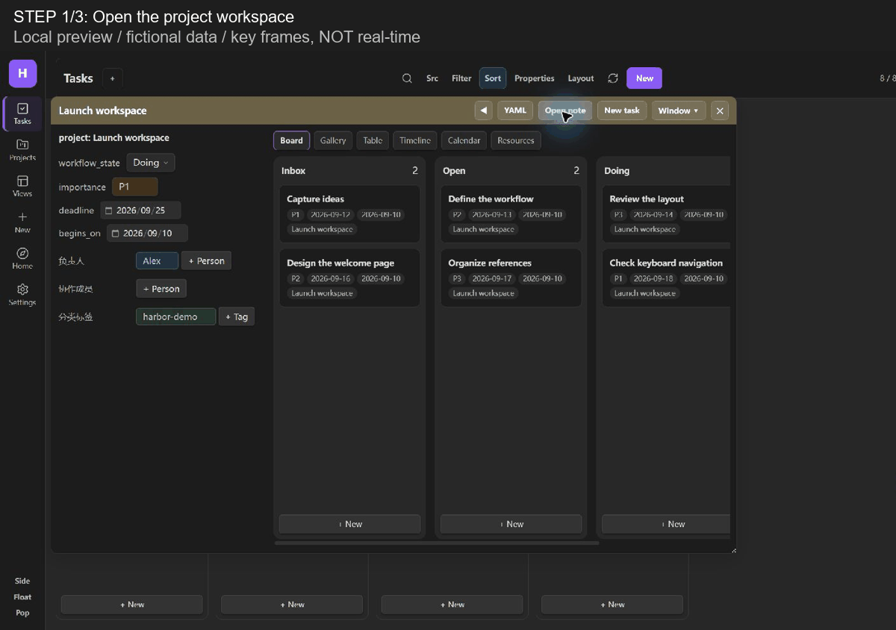

上图使用实际界面和虚构数据；GIF 为关键帧步骤演示，非实时录屏。展示展开项目、折叠为标题条，以及保留停靠条时切换工作台画廊。

### 项目、属性与新建入口

查看项目关联任务，编辑自己的 YAML 属性，再添加下一条行动。


<details>
<summary>查看深色主题与更多截图</summary>


[画廊](media/gallery.png) · [日历](media/calendar.png) · [表格](media/table.png) · [项目详情](media/project.png) · [新建弹窗](media/create.png) · [属性面板](media/properties.png)

</details>

## 安装

首次体验建议使用测试库。项目笔记中的嵌入式关联任务表需要启用 Obsidian 核心插件 **Bases（数据库）**。

### 通过 BRAT 安装

1. 安装并启用 [BRAT](https://github.com/TfTHacker/obsidian42-brat)。
2. 运行命令 **BRAT: Add a beta plugin for testing**。
3. 输入仓库地址：`nbclass986/harbor`。
4. 安装完成后，在第三方插件中启用 **Harbor**。

后续可使用 **BRAT: Check for updates to all beta plugins** 检查更新。实际 BRAT 安装与自动更新尚未完成本轮实机验收。

### 手动安装

从 [Release](https://github.com/nbclass986/harbor/releases/latest) 下载 `main.js`、`manifest.json`、`styles.css`，放入笔记库的 `.obsidian/plugins/harbor/` 文件夹，再重新加载 Obsidian 并启用插件。

请下载上述三个安装附件，而不是 GitHub 自动生成的 “Source code” 压缩包。

## 开箱使用教程

**已经有笔记和属性？先把现有属性接到 Harbor，再扫描已有内容，不用重新录入一套。**下面按「核对原属性 → 建立映射 → 扫描取值 → 添加自定义面板字段 → 验证写回」操作。

入口是 **Harbor 左侧栏 → 设置**。设置中的左列是 Harbor 内部字段，中间列填写笔记中实际的属性名，右侧勾选控制是否在属性面板显示。这里的“建立联系”是配置本地属性对应关系，不需要上传数据或连接服务器。

以下 4 段 GIF 来自测试库的真实操作截图，按关键帧合成并延长停留时间，非连续实时录屏。示例内容为虚构数据。

### 第一步：打开一篇已有笔记，分清“属性名”和“属性内容”

本次实拍笔记原本就有这些属性：

```yaml
type: task
进度: 待审核
priority: P2
客户名称: 示例客户甲
```

其中 **进度**是属性名，**待审核**是它的内容；**客户名称**是属性名，**示例客户甲**是它的内容。映射时填写属性名，不要把“待审核”填进字段映射。

先检查类型：这篇笔记已经使用 `type: task`，所以「类型属性（必需）」保持默认即可。如果你的笔记使用 `类型: 任务`，则将 type 右侧填写为 `类型`、task 右侧填写为 `任务`。项目和资料的类型值同样按自己的笔记设置。

### 第二步：把现有属性名映射到 Harbor

1. 进入 **设置 → 属性字段**，找到左列的 **status**。
2. 将右侧“你的笔记属性名”从 `status` 改成 **进度**。
3. 点击输入框外或按 Tab，保存映射；保持右侧显示勾选。
4. 其他内置字段按同样方式对应。名称已经相同的字段不需要改。

| Harbor 内部字段 | 如果你的笔记属性叫这个 | 中间列填什么 |
| --- | --- | --- |
| status | 进度 | `进度` |
| due | 截止日期 | `截止日期` |
| assignee | 负责人 | `负责人` |
| priority | priority | 保留 `priority` |

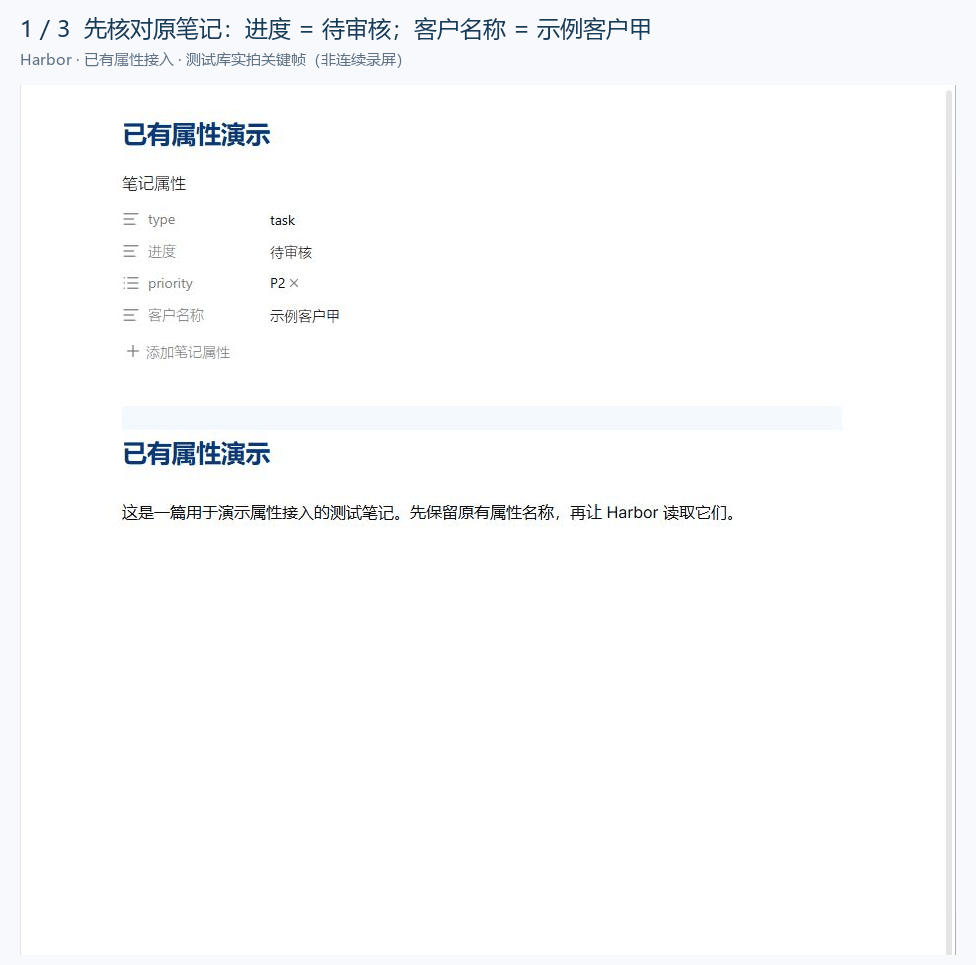

**完成标志：**status 那一行右侧显示“进度”。Harbor 此后会读写“进度”这个属性，不要求你把原笔记改成英文 `status`。

映射会作用于当前库的 Harbor 配置，**不会批量重命名旧笔记**。如果部分笔记用 `status`，另一些用“进度”，单个映射不会自动兼容两种键名，需要先规划统一方式。

### 第三步：扫描原有内容，不要逐个手动录入选项

1. **先完成上一步的字段映射**，再往下找到 **扫描库中已有取值**。
2. 点击 **扫描**，Harbor 会按当前映射读取库内 Markdown 笔记的属性。
3. 看下面的状态、优先级、人员和标签选项。本例中的 **待审核**会自动加入状态选项，已有人员和标签也会自动补入。

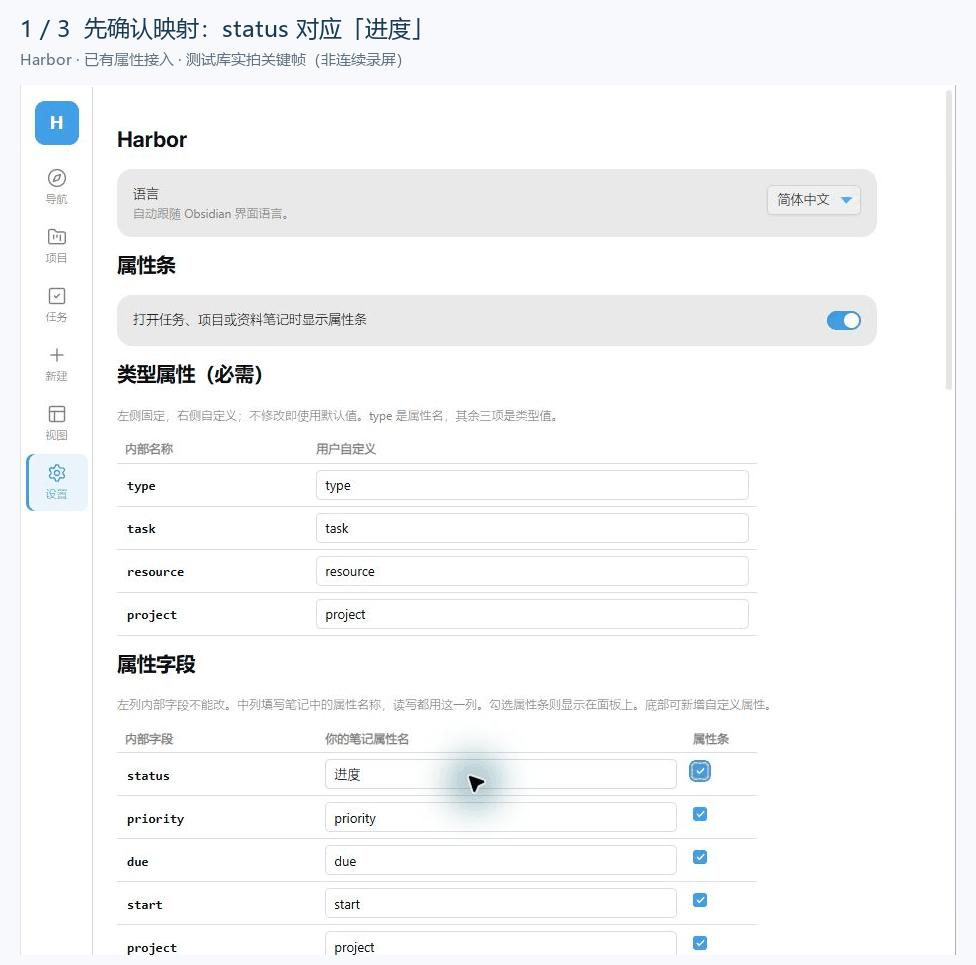

扫描会去重合并并保留已有选项，不会为了扫描去修改笔记，也不会要求你逐篇打开笔记。

| 自动补充的选项 | 从哪些映射字段读取 |
| --- | --- |
| 状态 | status 对应的实际属性，本例为“进度” |
| 优先级 | priority 对应的实际属性 |
| 人员 | assignee 和 participant 对应的实际属性，合并为同一名单 |
| 标签 | tags 对应的实际属性 |

**完成标志：**不曾手动输入的“待审核”等内容出现在选项中。新加入笔记后，可以再次扫描；若提示索引未就绪，等 Obsidian 完成索引再试。

扫描不会自动猜测属性映射，也不会自动创建自定义字段。日期、客户名称等任意字段不属于这次扫描生成选项的范围。

### 第四步：让自定义属性出现在面板里

“客户名称”不属于 Harbor 内置的状态、日期等字段，可以直接新增为面板字段。

1. 在 **设置 → 属性字段**表格底部的输入框中填写 **客户名称**，与原笔记属性名完全一致。
2. 点击 **新增**。
3. 确认表格中出现“客户名称”，右侧已勾选显示。
4. 打开那篇笔记；如果面板关闭了，点击笔记右上角 **三个点 → Harbor 属性面板**。

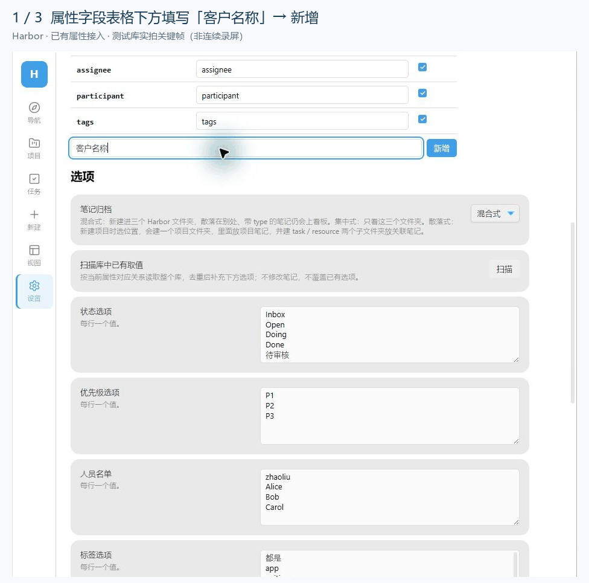

**完成标志：**面板里出现“客户名称”，并自动读出这篇笔记已有的“示例客户甲”。只需输入一次字段名称，不用再手动抄一遍每篇笔记的内容。

这里新增的是面板中的字段；笔记没有该属性时，不会凭空出现客户内容。也不会扫描全库客户名称并生成客户下拉名单。

### 第五步：确认读取正确，再验证修改写回

1. 打开已有笔记，确认面板中的 **进度 = 待审核**、**客户名称 = 示例客户甲**。
2. 在演示笔记的面板里，把客户名称改为 **示例客户乙**，点击别处并稍等保存。
3. 关闭 Harbor 面板，检查笔记原有属性：**客户名称**应已变为**示例客户乙**，属性名仍然相同。

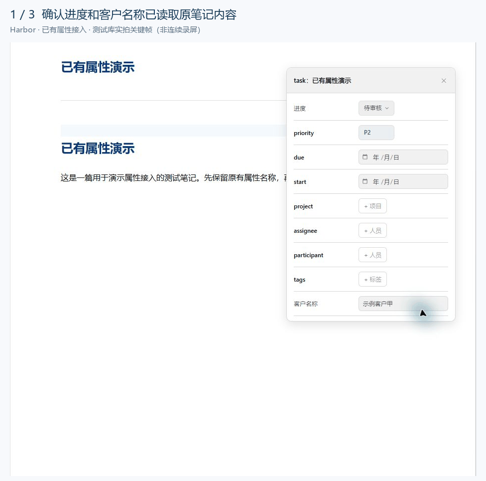

这一步验证的是 Harbor 与原笔记的读写对应关系。本次实拍已检查实际 Markdown 文件：`客户名称: 示例客户乙` 已写入，“进度”仍保留“待审核”，没有另建一个英文 status 属性。

至此，已有笔记的属性映射、取值扫描和自定义面板字段就接通了。后面再根据需要调整视图、筛选和排序。

<details>
<summary>全新笔记库：从默认设置开始，创建项目、任务和视图</summary>

先保留默认设置，创建一个项目和一条任务，再保存自己的第一个视图。下面以「发布个人网站 → 整理首页文案」为例。

安装并启用 Harbor 后，点击 Obsidian 最左侧工具栏中的 **H 图标**打开工作台。左侧栏顺序为 **导航 → 项目 → 任务 → 新建 → 视图 → 设置**；第一次使用先点「设置」。项目关联任务表需要开启 Obsidian 核心插件 **数据库 / Bases**。

以下 6 段 GIF 使用测试库真实界面截图合成，属于关键帧步骤演示，不是连续实时录屏。其他英文卡片是演示数据，不必照着创建。画面对应包含视图右键菜单和属性面板开关的本地版本。

### 第一步：确认语言和类型，先不改字段名

进入 **Harbor 左侧栏 → 设置**，按下面的表检查。

| 设置位置 | 第一次使用怎么选 | 为什么 |
| --- | --- | --- |
| 语言 | 简体中文 | 教程使用中文界面 |
| 属性条 | 保持开启 | 打开任务、项目或资料时可以编辑属性 |
| 类型属性：type | `type` | 这是笔记里存放类型的属性名称 |
| 类型属性：task | `task` | 代表任务 |
| 类型属性：resource | `resource` | 代表资料 |
| 类型属性：project | `project` | 代表项目 |

**右边已经是这些值，就不用重新输入。**例如默认任务会写入 `type: task`。`type` 是属性名，`task` 是这个属性的值，两者不是同一件事。

继续往下看「属性字段」：`status`、`priority`、`due`、`start`、`project` 等也先保持默认。右侧勾选表示让该字段出现在 Harbor 属性面板里。

这些设置会自动保存。输入框修改后点到别处即可，不需要寻找统一的“保存设置”按钮。

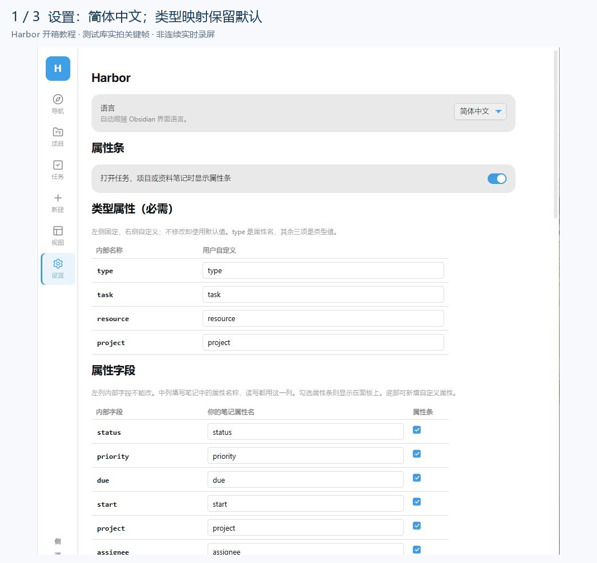

**完成标志：**语言为简体中文，属性条开启，四项类型映射与上表一致。

### 第二步：确认归档方式和状态选项

在同一设置页往下滚动，到「选项」。

1. **笔记归档：保留「混合式」**。Harbor 新建的笔记进入分类文件夹，也能识别其他目录中类型正确的笔记。
2. **状态选项：保留 Inbox、Open、Doing、Done**，每行一个值。
3. **优先级选项：保留 P1、P2、P3**，每行一个值。
4. **人员名单、标签选项：按需填写，也可以暂时不填。**示例画面中的人员和标签不是必填项。
5. 「笔记模板」先不调整，先跑通创建和使用流程。

可把 Inbox 理解为“待整理”，Open 理解为“准备做”，Doing 理解为“正在做”，Done 理解为“已完成”。新手先按这套状态使用，后面再决定是否自定义。

默认新建位置如下：

| 内容 | 默认目录 |
| --- | --- |
| 项目笔记 | `Harbor/Harbor_PROJECT` |
| 任务笔记 | `Harbor/Harbor_TASK` |
| 资料笔记 | `Harbor/Harbor_RESOURCE` |
| 关联数据库文件 | `Harbor/Harbor_BASE` |

**完成标志：**归档方式为混合式，状态和优先级选项已经可用。到这里，初次设置就完成了。

### 第三步：创建第一个项目

1. 左侧栏点击 **新建**。
2. 选择 **Project（项目 / 专题）**。
3. 标题输入 **教程示例：发布个人网站**。
4. 状态保留 **Open**，优先级保留 **P2**。日期、人员、标签和正文暂时可以不填。
5. 点击 **创建**。

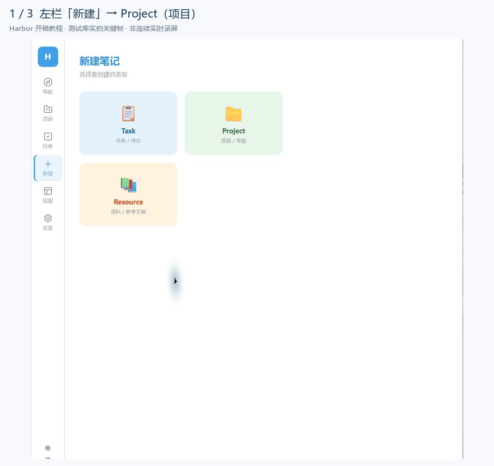

创建后会打开项目笔记，其中包含项目正文、关联任务表，以及「新建任务」「新建资料」按钮。

**完成标志：**能看到新项目笔记，文件位于 `Harbor/Harbor_PROJECT`。项目刚创建时任务表为空是正常的。

### 第四步：从项目里新建一条任务

项目是你想完成的结果，任务是为这个结果采取的下一步行动。

1. 在刚创建的项目笔记里，点击 **新建任务**。
2. 标题输入 **教程示例：整理首页文案**。
3. 检查「项目」字段：已经自动选中刚才的项目，不需要重复选择。
4. 状态保留 **Open**，优先级保留 **P2**，点击 **创建**。

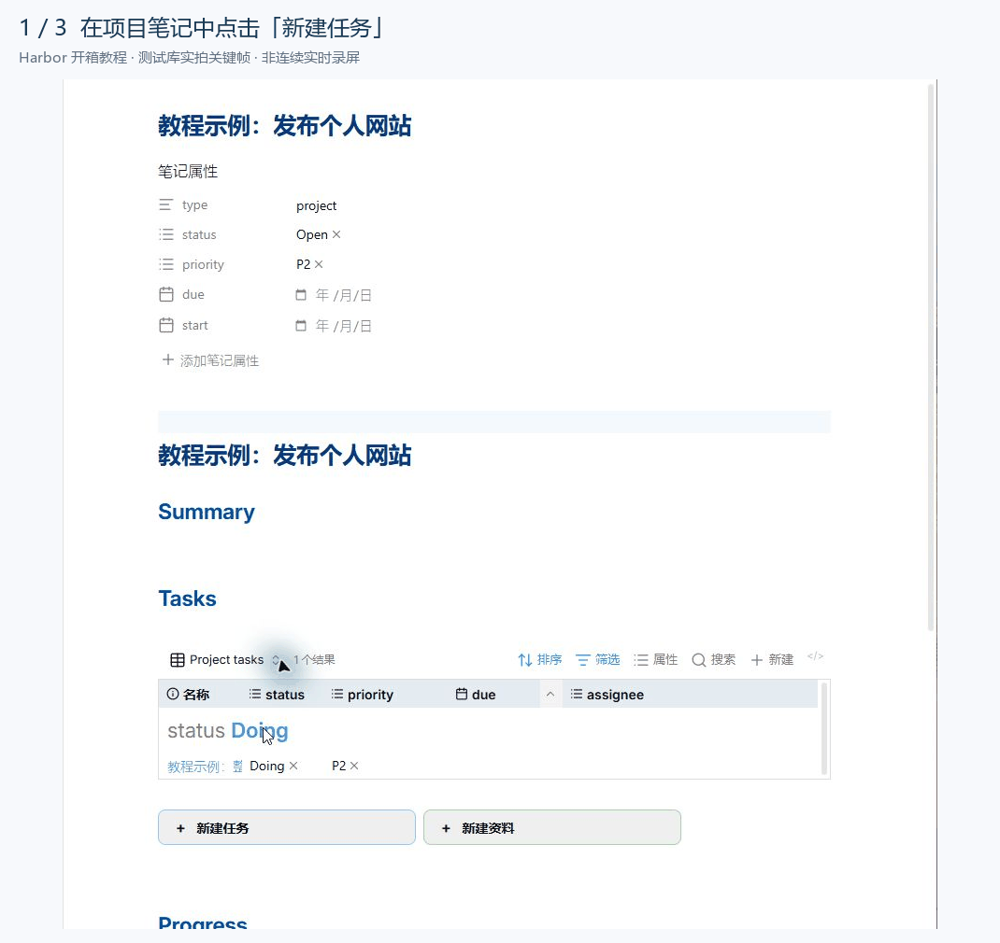

如果改从左侧栏「新建 → Task」创建，记得自行选择项目。资料也可以通过项目里的「新建资料」创建，保存与项目相关的参考内容。

**完成标志：**任务笔记已打开，属性面板中有项目链接；返回项目时，可在关联任务表中查看它。

### 第五步：更新任务状态，学会找回属性面板

1. 在任务的 Harbor 属性面板中点击 **status**。
2. 开始执行任务时，将 **Open** 改为 **Doing**；完成后可改为 **Done**。
3. 有明确时间安排时，再填写 **due（截止日期）** 和 **start（开始日期）**。没有日期的任务不必为了填满表单而随意选一天。
4. 面板暂时挡住正文时，点击面板右上角 **×**。
5. 想重新打开时，点击 **Markdown 笔记右上角三个点 → Harbor 属性面板**。

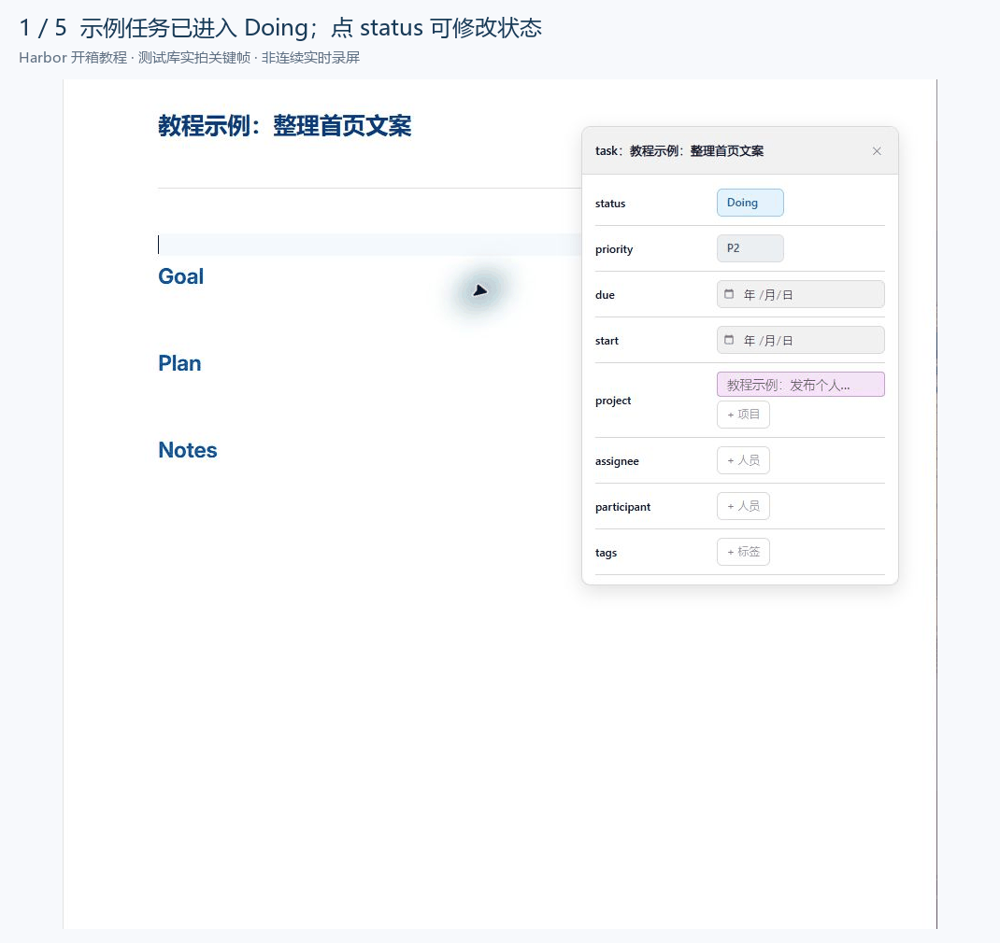

属性面板会把修改写回 Markdown 笔记。此次示例文件实际保存了 `Doing` 状态以及指向项目的链接。

**完成标志：**回到 Harbor 的「任务」看板，示例任务出现在 Doing 列；关闭的属性面板能通过三个点菜单重新打开。

### 第六步：保存并命名一个常用视图

1. 左侧栏进入 **任务**。
2. 点击顶部任务标题或视图标签旁边的 **+**，保存当前配置为一个新视图。
3. **右击顶部“新视图”标签**，选择 **重命名**。
4. 输入 **教程：任务总览**，按 **Enter** 保存；按 Esc 可以取消重命名。
5. 点击工具栏 **布局 → 表格**，观察同一批任务变成表格。
6. 需要看状态推进时，再从「布局」切回「看板」。筛选、排序和显示属性可在熟悉后继续调整。

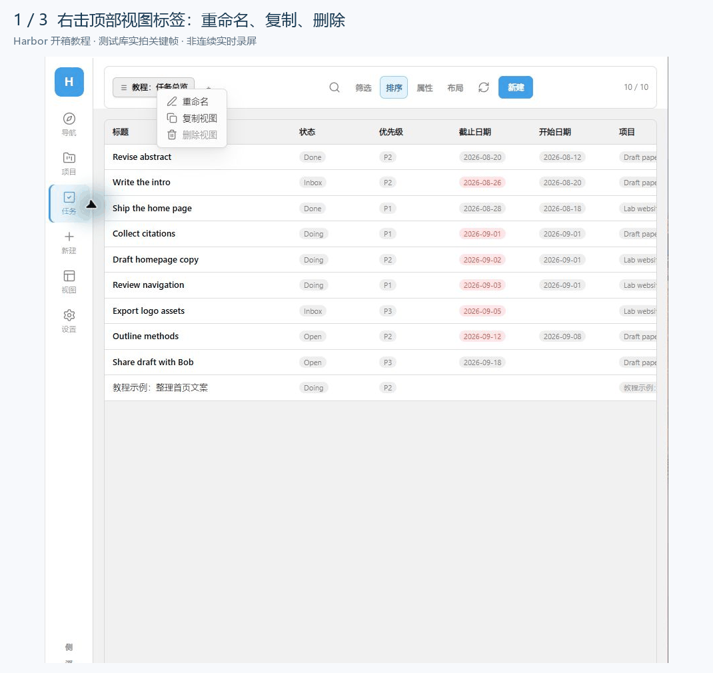

右键菜单还有两个选项：

| 选项 | 用途 |
| --- | --- |
| 复制视图 | 保留原视图配置，复制出另一个视图后再调整 |
| 删除视图 | 删除保存的视图配置，不是删除任务笔记；同类只剩一个视图时禁用 |

注意区分：**顶部视图标签**是右击的位置；**左侧栏“视图”**是集中查看已保存视图的页面。

**完成标志：**顶部标签显示自己的名称，布局可以切换；左侧「视图」页面能看到保存的视图。

### 第七步：每天从哪里开始

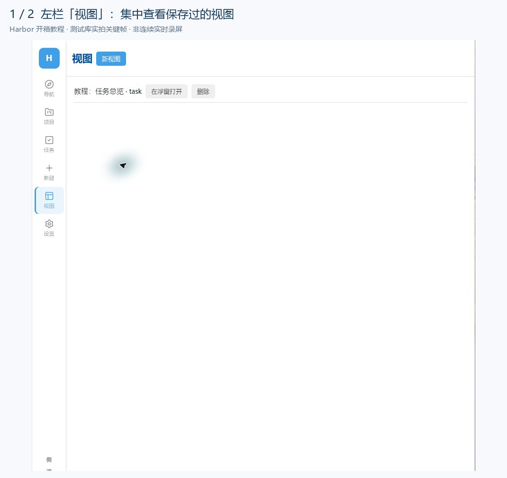

建议先形成一个简单习惯：

1. **导航**：看即将到期和超时未完成的事项。
2. **项目**：确定今天要推进的项目。
3. **任务**：把准备执行的事项改为 Doing，做完改为 Done。
4. **新建**：补充下一步任务或参考资料。
5. **视图**：打开自己保存的常用配置。

导航中的「即将到期」依据截止日期，显示未来 7 天内到期且未完成的任务；不填写截止日期的任务不会进入这个分区。

当前「Personal」分区根据项目名或标签是否包含 Personal 筛选；「闪念」分区按关联的 FLOMO / flomo 项目筛选。它们不是全部任务的汇总，空白不代表任务丢失。「闪念胶囊」项目与这个闪念分区的筛选规则也不要混为一谈。

</details>

## Notion 式属性管理，数据留在本地

像管理 Notion 数据库一样，组织你的本地笔记。自定义属性名称，以及状态、优先级、人员、标签等属性内容；配合筛选、排序和多种视图，建立符合自己习惯的工作台。数据仍保存在 Obsidian 的 Markdown 与 YAML 中。

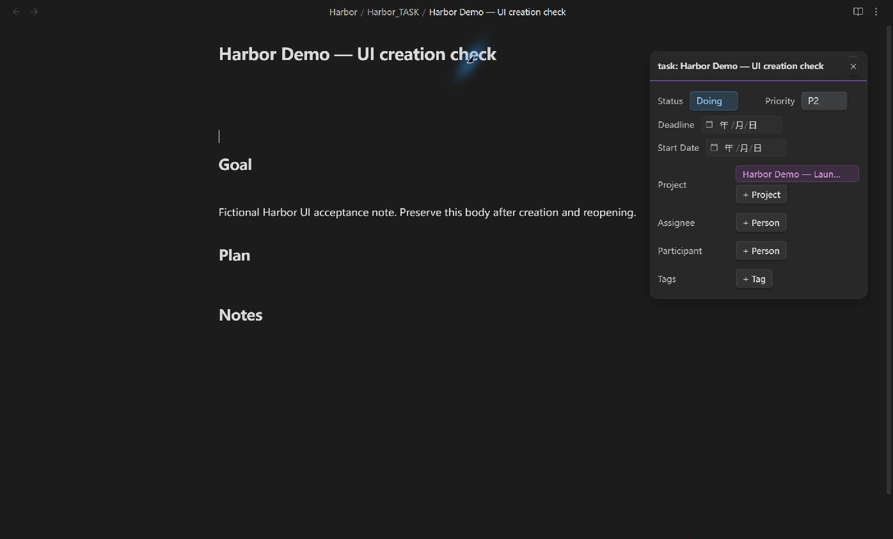

图中使用自定义字段名 `workflow_state`、`importance`、`deadline`、`负责人` 和 `分类标签`，右侧显示状态、优先级、日期、人员与标签内容。字段名称和内容不必照搬这份演示，可以按自己的工作习惯配置。

这里描述的是属性与多视图的使用方式，不代表完整支持 Notion 的所有数据库能力。

### 保留你自己的 YAML 名称

**类型属性是必需的。** 在 **Harbor 设置 → 类型属性（必需）** 中，将内部 `type` 映射到笔记使用的 YAML 键。默认是 `type`；如果填入 `TT`，任务笔记就应包含 `TT: task`，项目和资料分别使用 `TT: project`、`TT: resource`。没有该属性时需补上；Harbor 新建笔记和分类目录补类型规则也使用映射键。修改映射不会批量重命名已有笔记属性。

表格中的 `task`、`resource`、`project` 也可分别映射为自定义类型值。初始值与左侧同名，不修改即可使用；例如将 `type` 改为 `TT`、`task` 改为 `待办`，任务笔记就使用 `TT: 待办`。

字段映射把 **Harbor 内部字段**连接到**笔记中实际使用的 YAML 键**。

| Harbor 内部字段 | 你的 YAML 键示例 | 属性面板显示 |
| --- | --- | --- |
| `status` | `workflow_state` | `workflow_state` |
| `due` | `deadline` | `deadline` |
| `assignee` | `负责人` | `负责人` |

例如，笔记使用 `deadline`，就在 `due` 对应的设置中填写 `deadline`。Harbor 按映射读写这个键，属性面板也显示 `deadline`，而不是另设展示名称。

**设置映射不等于批量重命名已有笔记。** 请先核对实际 YAML 键名，再配置对应关系。

<details>
<summary>查看一条使用默认字段的任务笔记</summary>

下面使用默认键名；如果修改了字段映射，笔记应使用对应的实际键名。

```markdown
---
type: task
status: Open
priority: P2
due: 2026-09-25
start: 2026-09-18
project:
  - "[[发布个人网站]]"
assignee: 张三
tags: writing
---
## Goal

整理首页文案。
```

文件名作为笔记标题。默认状态为 `Inbox`、`Open`、`Doing`、`Done`，优先级为 `P1`、`P2`、`P3`。

</details>

## 适应你的笔记库

| 目录模式 | 组织方式 |
| --- | --- |
| 混合式（默认） | 新建笔记进入 Harbor 分类目录，也识别库中符合类型配置的笔记 |
| 集中式 | 只读取配置的任务、项目和资料目录 |
| 散落式 | 新建项目时选择位置，创建项目文件夹及 `task`／`resource` 子目录 |

默认目录为 `Harbor/Harbor_TASK`、`Harbor/Harbor_PROJECT`、`Harbor/Harbor_RESOURCE` 和 `Harbor/Harbor_BASE`，可在设置中调整。

你还可以配置状态、优先级、人员、标签、属性面板字段和三类笔记模板。模板支持 `{{title}}`、`{{body}}`；未提供 `{{body}}` 时，新建表单正文会插入指定标题下。

界面配色跟随 Obsidian 主题，布局样式限定在 Harbor 内部。已检查默认浅色、默认深色及 Blue Topaz；不能保证所有第三方主题或自定义 CSS 都没有冲突。

## 遇到问题时检查这里

| 现象 | 先检查 |
| --- | --- |
| 项目或任务没有出现在工作台 | 笔记类型键和值是否与设置一致；当前筛选是否排除了它；归档范围是否包含所在目录 |
| 找不到刚创建的笔记 | 到对应 Harbor 分类目录查找；也可以用 Obsidian 快速切换搜索标题 |
| 属性面板没有出现 | 是否打开了任务、项目或资料笔记；设置里的属性条是否开启；再试三个点菜单中的开关 |
| 项目中的任务表无法正常显示 | 检查核心插件「数据库 / Bases」是否开启 |
| 导航或日历没有某条任务 | 先检查日期和分区范围，再回到任务总览确认笔记是否存在 |
| 右键没有三个视图选项 | 在顶部的视图标签上右击；更新后重新加载 Harbor |

## 当前状态与已知限制

- **桌面**：在 Windows / Obsidian 1.13.7 下检查了核心功能、字段映射、主题与窄容器；原生单卡、多卡拖放及日历改期由用户实机确认。
- **移动端**：尚未完成手机实机验收，窄栏测试不等于手机测试。
- **BRAT**：Release 已提供安装附件；客户端安装及自动更新仍待单独验证。
- **Notion**：同步暂未开放，相关入口已隐藏；已有配置保留。

## 反馈与许可

欢迎在 [Issues](https://github.com/nbclass986/harbor/issues) 提交问题或建议。请附上插件与 Obsidian 版本、操作系统、复现步骤，以及去除私人信息的截图或示例笔记。**请勿上传 Notion token 或插件的 `data.json`。**

当前版本按 [免费试用许可](LICENSE) 提供，可免费用于个人及工作内部使用；不授予再分发、销售或发布修改版的许可。此前按 MIT 发布的版本保留其原授权。
